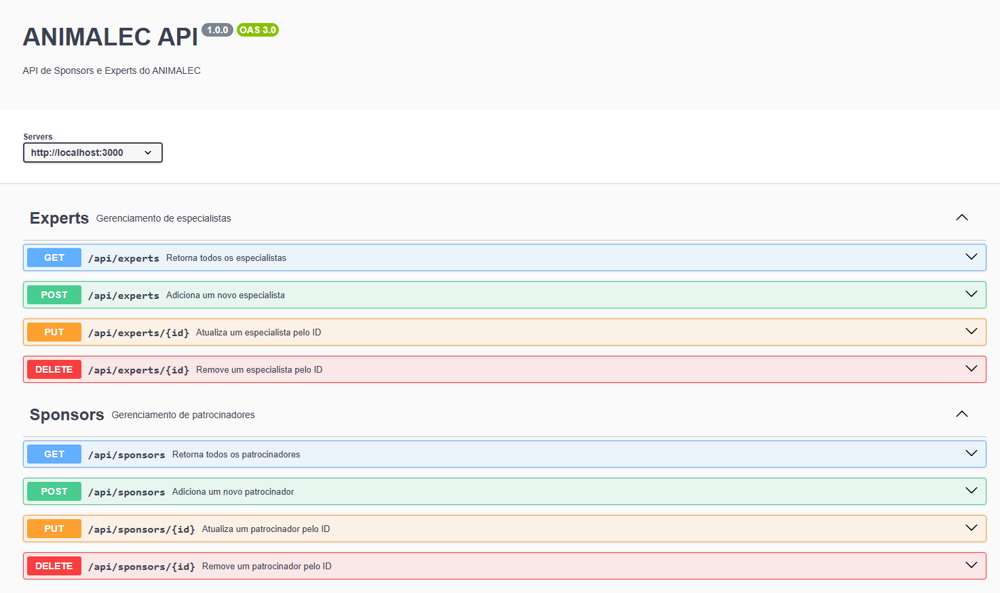
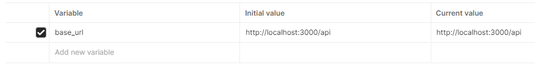
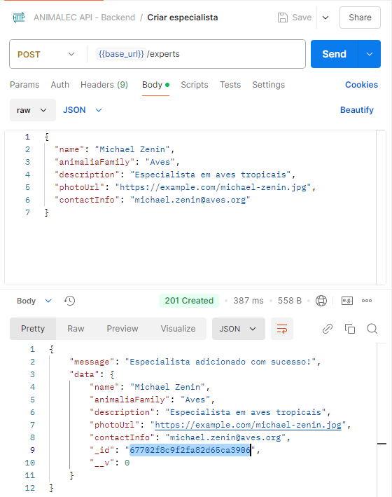
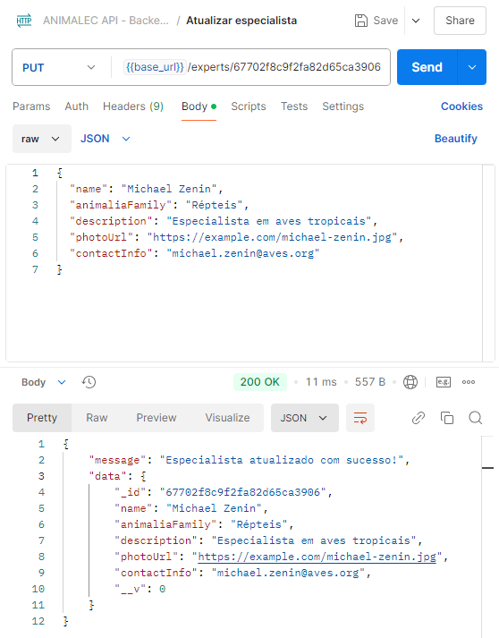
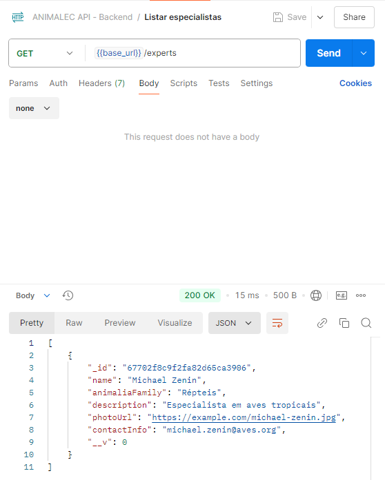
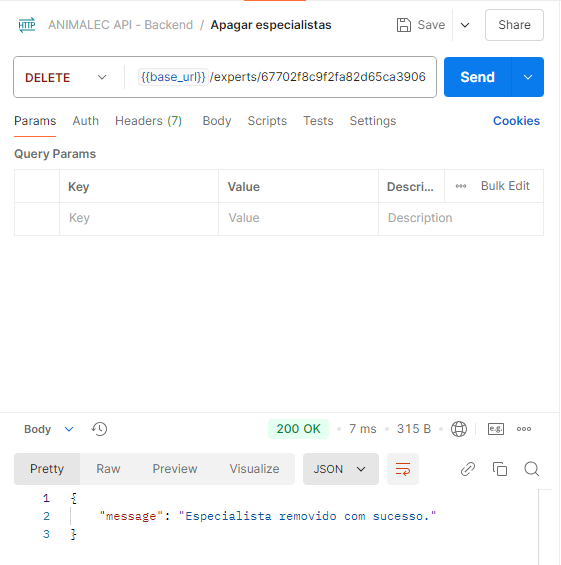
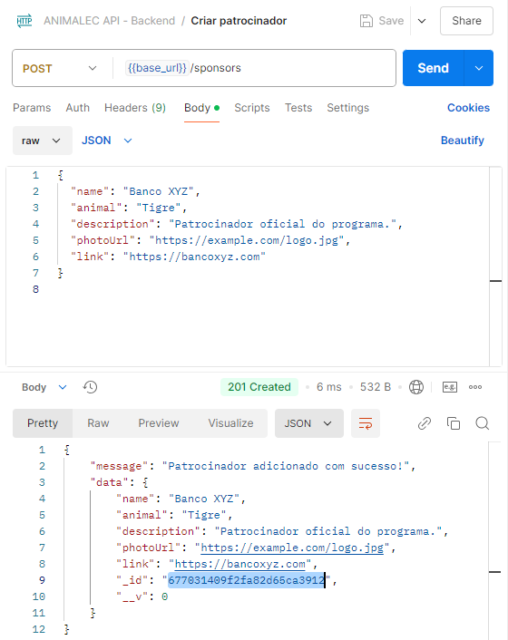
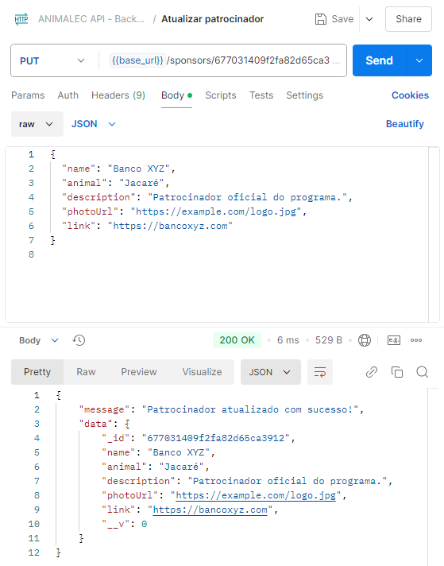
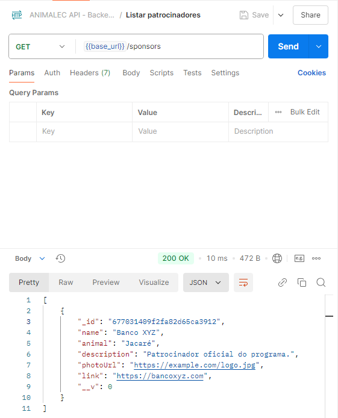
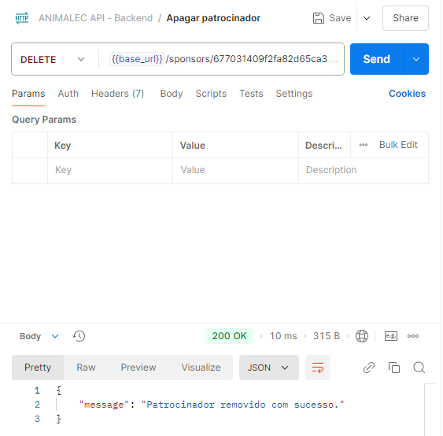

# Backend ANIMALEC - Patrocinadores e Especiliastas
### Renan Pedreira de Oliveira 2401854


## 1. Descrição Geral

Este backend adicional foi desenvolvido para o sistema **ANIMALEC** utilizando **Express.js** e documentado com **Swagger**. Ele foi criado para complementar o backend existente, permitindo uma implementação modular e escalável. O objetivo principal é fornecer suporte completo às operações CRUD (Create, Read, Update, Delete) para as entidades **Sponsors** (Patrocinadores) e **Experts** (Especialistas), assegurando validações robustas e documentação interativa.

### **Motivação**
A necessidade de criar este backend surgiu da necessidade de expandir o sistema ANIMALEC com novas funcionalidades, mantendo a consistência e o padrão de qualidade do sistema. A implementação de um backend dedicado para essas duas entidades promove uma separação clara de responsabilidades, facilita a manutenção e melhora a integração futura com outros módulos.

### **Inicialização**
Para inicializar a API é preciso correr o comando `node index.js`

### **Etapas de Criação**
1. **Configuração Inicial do Projeto**:
   - Foi criado um novo projeto Node.js utilizando `npm init` para configurar o `package.json`.
   - As dependências essenciais foram instaladas: `express`, `mongoose`, `swagger-jsdoc`, `swagger-ui-express`, `cors` e `body-parser`.

2. **Definição da Estrutura de Pastas**:
   - O projeto foi estruturado com pastas para configuração (`config`), modelos (`models`), controladores (`controllers`), rotas (`routes`) e documentação (`swagger`).

3. **Conexão com MongoDB**:
   - Configuração da base de dados no MongoDB utilizando o módulo `mongoose`. A conexão foi implementada no ficheiro `db.js` para reutilização em todo o projeto.

4. **Criação dos Modelos**:
   - Modelos foram criados para representar as entidades `Expert` e `Sponsor`, com definições claras de campos obrigatórios e opcionais.

5. **Implementação dos Controladores**:
   - Os controladores foram desenvolvidos para encapsular a lógica de negócios e interagir com o banco de dados. Operações como busca, criação, atualização e remoção foram implementadas para ambas as entidades.

6. **Definição de Rotas**:
   - Rotas específicas foram configuradas para mapear os endpoints da API para as funções dos controladores, garantindo a separação de responsabilidades.

7. **Documentação com Swagger**:
   - Todas as rotas e modelos foram documentados com **Swagger**, permitindo uma visualização interativa da API em um ambiente web acessível em `/api-docs`.

8. **Plano de Testes com Postman**:
   - Endpoints foram testados usando **Postman**, garantindo que as funcionalidades estejam consistentes e respeitem as validações implementadas.

Este backend, com base em boas práticas e modularidade, assegura que o sistema seja escalável, mantenível e pronto para integração com outros módulos ou APIs futuras.


### **Estrutura de Ficheiros**

O backend foi estruturado em diferentes pastas para garantir organização e modularidade no código:

- **config/**: Contém configurações essenciais do projeto, como a configuração da conexão com o banco de dados MongoDB. 
  - **`db.js`**: Configura e inicializa a conexão com o MongoDB, utilizando variáveis de ambiente para segurança e flexibilidade.

- **controllers/**: Responsável pela lógica principal das rotas. Cada entidade possui um controlador que implementa as operações CRUD e validações básicas.
  - **`expert.controller.js`**: Contém a lógica de manipulação para a entidade **Expert**, incluindo operações como criação, leitura, atualização e remoção.
  - **`sponsor.controller.js`**: Fornece a lógica para gerenciar a entidade **Sponsor**, incluindo validações e interações com o banco de dados.

- **models/**: Define os esquemas de dados utilizados no MongoDB, garantindo que as entidades tenham uma estrutura consistente.
  - **`expert.model.js`**: Modelo da entidade **Expert**, com campos como `name`, `animaliaFamily`, `description`, `photoUrl`, e `contactInfo`.
  - **`sponsor.model.js`**: Modelo da entidade **Sponsor**, com campos como `name`, `animal`, `description`, `photoUrl`, e `link`.

- **routes/**: Contém as rotas que mapeiam os endpoints da API para os métodos dos controladores. Cada entidade tem suas próprias rotas.
  - **`experts.routes.js`**: Define os endpoints para manipular a entidade **Expert**, como `GET /api/experts`, `POST /api/experts`, entre outros.
  - **`sponsors.routes.js`**: Define os endpoints para manipular a entidade **Sponsor**, como `GET /api/sponsors`, `POST /api/sponsors`, entre outros.

- **swagger/**: Configura a documentação interativa da API utilizando o Swagger.
  - **`swagger.js`**: Configura o Swagger com informações sobre a API, incluindo título, descrição, versão, e exemplos para cada endpoint documentado.

### **Rotas da API**

As rotas foram configuradas para suportar operações CRUD completas para as entidades **Experts** e **Sponsors**, incluindo validações de entrada e tratamento de erros. Todas as rotas foram documentadas com **Swagger**, permitindo fácil entendimento e testes interativos.

#### **Rotas para Experts**
| Método | Endpoint             | Descrição                         | Validações                                                   |
|--------|-----------------------|-------------------------------------|-------------------------------------------------------------|
| GET    | `/api/experts`        | Retorna todos os especialistas     | N/A                                                         |
| POST   | `/api/experts`        | Adiciona um novo especialista      | Os campos `name` e `animaliaFamily` são obrigatórios.       |
| PUT    | `/api/experts/:id`    | Atualiza um especialista pelo ID   | O ID fornecido deve ser válido e os campos enviados no body são opcionais. |
| DELETE | `/api/experts/:id`    | Remove um especialista pelo ID     | O ID fornecido deve ser válido.                             |

#### **Rotas para Sponsors**
| Método | Endpoint             | Descrição                         | Validações                                                   |
|--------|-----------------------|-------------------------------------|-------------------------------------------------------------|
| GET    | `/api/sponsors`       | Retorna todos os patrocinadores    | N/A                                                         |
| POST   | `/api/sponsors`       | Adiciona um novo patrocinador      | Os campos `name` e `animal` são obrigatórios.               |
| PUT    | `/api/sponsors/:id`   | Atualiza um patrocinador pelo ID   | O ID fornecido deve ser válido e os campos enviados no body são opcionais. |
| DELETE | `/api/sponsors/:id`   | Remove um patrocinador pelo ID     | O ID fornecido deve ser válido.                             |

---

### **Validações Implementadas**
- **Campos Obrigatórios**: Validados nos controladores antes de processar o request.
- **IDs Válidos**: As rotas `PUT` e `DELETE` verificam se o ID fornecido existe e é válido no MongoDB.
- **Tratamento de Erros**: Se algo der errado (por exemplo, falha na conexão com o banco de dados), uma mensagem de erro é retornada com o status HTTP apropriado.


## **Documentação com Swagger**

A documentação da API foi implementada utilizando **Swagger**, que fornece uma interface interativa para visualização e teste dos endpoints. O Swagger facilita a integração com outros sistemas e melhora o entendimento da API pelos desenvolvedores.

### **Configuração do Swagger**
A configuração do Swagger foi implementada no arquivo `swagger.js`. Este arquivo utiliza a biblioteca `swagger-jsdoc` para gerar automaticamente a documentação a partir de comentários nas rotas e controladores.

#### Código de Configuração:
```javascript
const swaggerJsdoc = require("swagger-jsdoc");
const swaggerUi = require("swagger-ui-express");

const options = {
  definition: {
    openapi: "3.0.0",
    info: {
      title: "API ANIMALEC - Backend Adicional",
      version: "1.0.0",
      description: "Documentação da API para as entidades Experts e Sponsors.",
    },
    servers: [
      {
        url: "http://localhost:3000",
        description: "Servidor local",
      },
    ],
  },
  apis: ["./routes/*.js", "./models/*.js", "./controllers/*.js"],
};

const swaggerSpec = swaggerJsdoc(options);

module.exports = { swaggerUi, swaggerSpec };
```

### Como Acessar a Documentação

Após iniciar o servidor, a documentação da API pode ser acessada em:

**Endpoint do Swagger**: http://localhost:3000/api-docs 



## **Plano de Testes**

Para validar o funcionamento do backend adicional, realizamos testes utilizando o **Postman**, cobrindo todas as funcionalidades CRUD para as entidades **Experts** e **Sponsors**. Cada teste foi documentado com prints, mostrando os pedidos enviados e as respostas recebidas.

Para simplificar as urls, uma variável foi criada:



Para cada entidade foi seguido o plano:
1) Criação de uma entidade **(POST)**
2) Atualização de um campo da entidade **(PUT)**
3) Listagem de itens da entidade **(GET)**
4) Apagar a entidade **(DELETE)**

### **Testes**

**Criação de um Especialista - 67702f8c9f2fa82d65ca3906**




**Atualização do Especialista 67702f8c9f2fa82d65ca3906**




**Listagem de Especialistas**



**Remoção do Especialista 67702f8c9f2fa82d65ca3906**




**Criação de um Patrocinador - 677031409f2fa82d65ca3912**



**Atualização do Patrocinador 677031409f2fa82d65ca3912**



**Listagem de Patrocinador**



**Remoção do Patrocinador 677031409f2fa82d65ca3912**

